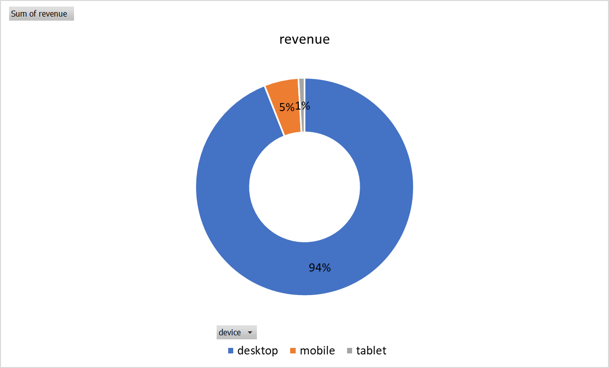
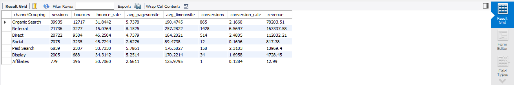
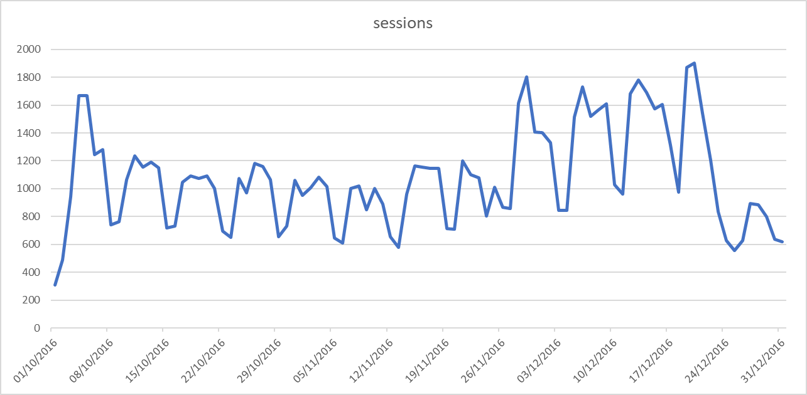

# Digital Marketing Strategy Optimisation (SQL) — Google Merchandise Store

**Scope:** US web sessions, **Oct 1–Dec 31, 2016** (Google Merchandise Store sample).  
**Tools:** MySQL (Workbench).  
**Goal:** Turn raw traffic & behavior into actions for **acquisition, retention, monetization, and mobile UX**.

---

## Quick Summary (20s)
- Merged Oct–Dec tables → built a robust **session key** `fullvisitorid-visitid` and ran **weekday, device, region, channel** analyses.
- **Monday** has the **highest conversion**; weekends drop.
- **Mobile** ≈ **25% of sessions** but only ≈ **5% of revenue** → urgent **mobile CRO/checkout** improvements.
- **Referral** tops conversion (≈ **7%**). Organic strong; Social weak on conversion.
- **Washington & Illinois** over-index on **mobile revenue** → target with localized promos.

---
      

---

## DATASETS

